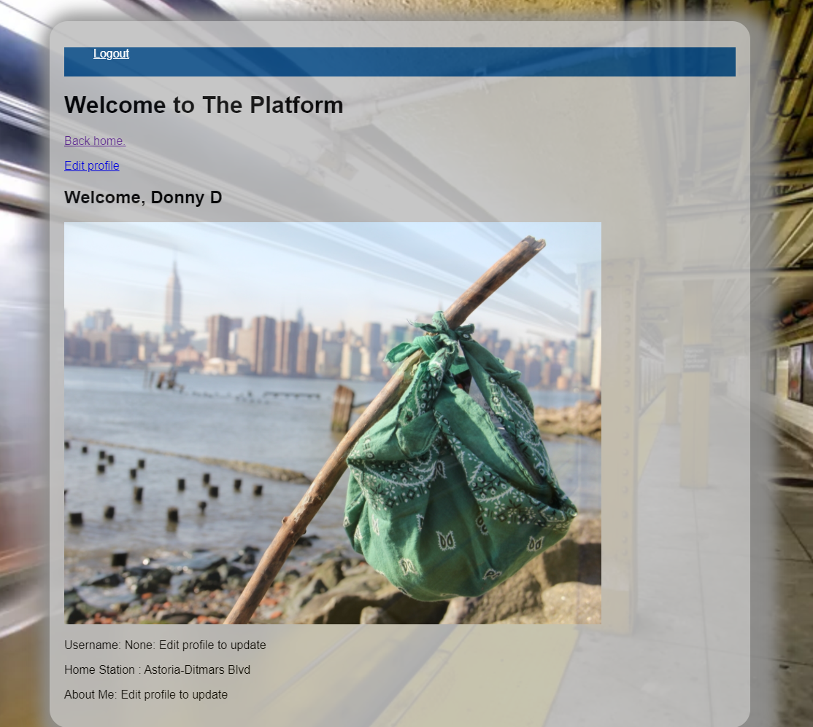
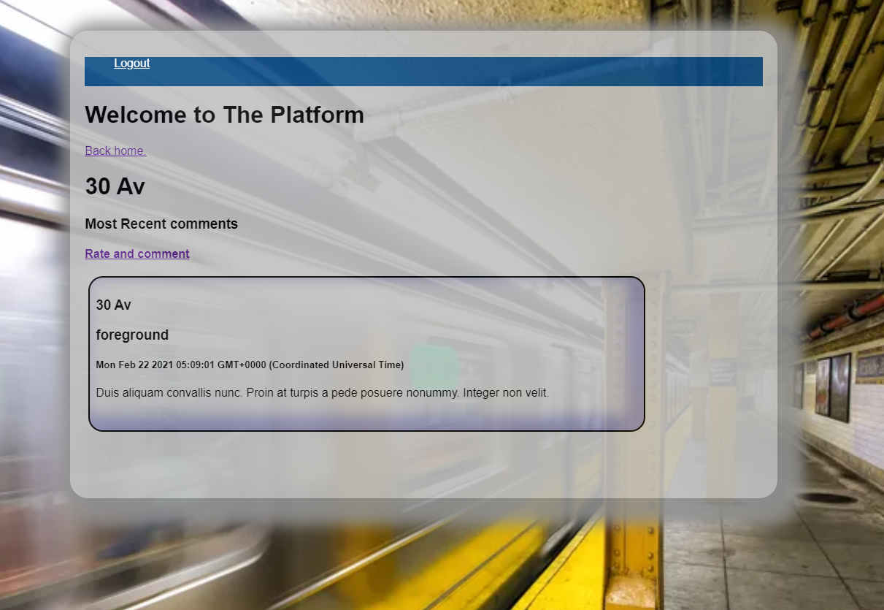

# The Platform

Finally, social media for mass transit.

## Contents

* Backstory
* Technology
* Installation
* Screenshots

### Backstory

The Platform (formerly Subway Club) is a social media platform for commuters on the MTA's subway system in New York City.

### Technology

The platform runs in NodeJS and uses Cloudinary for image management. 

### Installation

No need to install anything. The Platform is up and running on Heroku at https://the-platform-nyc.herokuapp.com/.

### Screenshots

